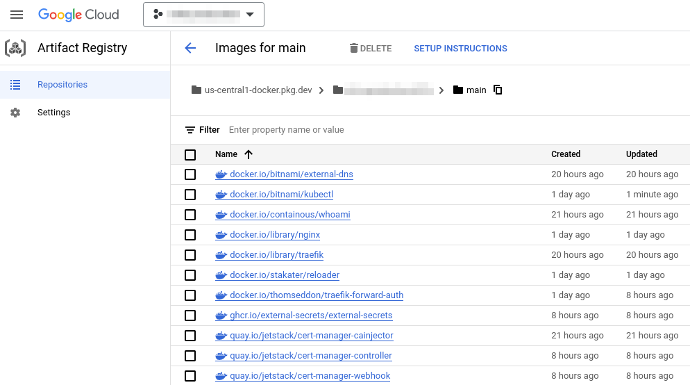

# Getting started

This document will provide guidance for installing `k8s-image-swapper`.

## Prerequisites

`k8s-image-swapper` will automatically create image repositories and mirror images into them.
This requires certain permissions for your target registry (_only AWS ECR and GCP ArtifactRegistry are supported atm_).

Before you get started choose a namespace to install `k8s-image-swapper` in, e.g. `operations` or `k8s-image-swapper`.
Ensure the namespace exists and is configured as your current context[^1].
All examples below will omit the namespace.

### AWS ECR as target registry

AWS supports a variety of authentication strategies.
`k8s-image-swapper` uses the official Amazon AWS SDK and therefore supports [all available authentication strategies](https://docs.aws.amazon.com/sdk-for-go/v1/developer-guide/configuring-sdk.html).
Choose from one of the strategies below or an alternative if needed.

#### IAM credentials

1. Create an IAM user (e.g. `k8s-image-swapper`) with permissions[^2] to create ECR repositories and upload container images.
   An IAM policy example can be found in the footnotes[^2].
2. Create a Kubernetes secret (e.g. `k8s-image-swapper-aws`) containing the IAM credentials you just obtained, e.g.

    ```bash
    kubectl create secret generic k8s-image-swapper-aws \
      --from-literal=aws_access_key_id=<...> \
      --from-literal=aws_secret_access_key=<...>
    ```

#### Using ECR registries cross-account

Although ECR allows creating registry policy that allows reposistories creation from different account, there's no way to push anything to these repositories.
ECR resource-level policy can not be applied during creation, and to apply it afterwards we need ecr:SetRepositoryPolicy permission, which foreign account doesn't have.

One way out of this conundrum is to assume the role in target account

```yaml
target:
  type: aws
  aws:
    accountId: 123456789
    region: ap-southeast-2
    role: arn:aws:iam::123456789012:role/roleName
```
!!! note
    Make sure that target role has proper trust permissions that allow to assume it cross-account

!!! note
    In order te be able to pull images from outside accounts, you will have to apply proper access policy


#### Access policy

You can specify the access policy that will be applied to the created repos in config. Policy should be raw json string.
For example:
```yaml
target:
  type: aws
  aws:
    accountId: 123456789
    region: ap-southeast-2
    role: arn:aws:iam::123456789012:role/roleName
    accessPolicy: |
      {
        "Statement": [
          {
            "Sid": "AllowCrossAccountPull",
            "Effect": "Allow",
            "Principal": {
              "AWS": "*"
            },
            "Action": [
              "ecr:GetDownloadUrlForLayer",
              "ecr:BatchGetImage",
              "ecr:BatchCheckLayerAvailability"
            ],
            "Condition": {
              "StringEquals": {
                "aws:PrincipalOrgID": "o-xxxxxxxxxx"
              }
            }
          }
        ],
        "Version": "2008-10-17"
      }
```

#### Lifecycle policy

Similarly to access policy, lifecycle policy can be specified, for example:

```yaml
target:
  type: aws
  aws:
    accountId: 123456789
    region: ap-southeast-2
    role: arn:aws:iam::123456789012:role/roleName
    lifecyclePolicy: |
      {
        "rules": [
          {
            "rulePriority": 1,
            "description": "Rule 1",
            "selection": {
              "tagStatus": "any",
              "countType": "imageCountMoreThan",
              "countNumber": 1000
            },
            "action": {
              "type": "expire"
            }
          }
        ]
      }
```

#### Service Account

1. Create an Webidentity IAM role (e.g. `k8s-image-swapper`) with the following trust policy, e.g
```
{
  "Version": "2012-10-17",
  "Statement": [
    {
      "Effect": "Allow",
      "Principal": {
        "Federated": "arn:aws:iam::${your_aws_account_id}:oidc-provider/${oidc_image_swapper_role_arn}"
      },
      "Action": "sts:AssumeRoleWithWebIdentity",
      "Condition": {
        "StringEquals": {
          "${oidc_image_swapper_role_arn}:sub": "system:serviceaccount:${k8s_image_swapper_namespace}:${k8s_image_swapper_serviceaccount_name}"
        }
      }
    }
  ]
}
```

2. Create and attach permission policy[^2] to the role from Step 1..

Note: You can see a complete example below in [Terraform](Terraform)

### GCP Artifact Registry as a target registry

To target a GCP Artifact Registry set the `target.type` to `gcp` and provide additional metadata in the configuration.

```yaml
target:
  type: gcp
  gcp:
    location: us-central1
    projectId: gcp-project-123
    repositoryId: main
```

!!! note
This is fundamentally different from the AWS ECR implementation since all images will be stored under *one* GCP Artifact Registry repository.
<p align="center">
  
</p>


#### Create Repository

Create and configure a single GCP Artifact Registry repository to store Docker images for `k8s-iamge-swapper`.

   ```hcl
   resource "google_artifact_registry_repository" "repo" {
     project       = var.project_id
     location      = var.region
     repository_id = "main"
     description   = "main docker repository"
     format        = "DOCKER"
   }
   ```

#### IAM for GKE / Nodes / Compute

Give the compute service account that the nodes use, permissions to pull images from Artifact Registry

   ```hcl
   resource "google_project_iam_member" "compute_artifactregistry_reader" {
     project = var.project_id
     role    = "roles/artifactregistry.reader"
     member  = "serviceAccount:${var.compute_sa_email}"
   }
   ```

Allow GKE node pools to access Artifact Registry API via oauth scope `https://www.googleapis.com/auth/devstorage.read_only`

   ```hcl
   resource "google_container_node_pool" "primary_nodes_v1" {
     project  = var.project_id
     name     = "${google_container_cluster.primary.name}-node-pool-v1"
     location = var.region
     cluster  = google_container_cluster.primary.name
     ...
     node_config {
       oauth_scopes = [
         ...
         "https://www.googleapis.com/auth/devstorage.read_only",
       ]
       ...
     }
     ...
   }
   ```

#### IAM for `k8s-image-swapper`

On GKE, leverage Workload Identity for the `k8s-image-swapper` K8s service account

1. Enable Workload Identity on the GKE cluster.
   https://cloud.google.com/kubernetes-engine/docs/how-to/workload-identity
   ```hcl
   resource "google_container_cluster" "primary" {
     ...
     workload_identity_config {
       workload_pool = "${var.project_id}.svc.id.goog"
     }
     ...
   }
   ```
2. Setup a Google Service Account (GSA) for `k8s-image-swapper`.
   ```hcl
   resource "google_service_account" "k8s_image_swapper_service_account" {
     project      = var.project_id
     account_id   = k8s-image-swapper
     display_name = "Workload identity for kube-system/k8s-image-swapper"
   }
   ```
3. Setup Workload Identity for the GSA
   This example assumes `k8s-image-swapper` is deployed to the `kube-system` namespace and uses `k8s-image-swapper` as the K8s service account name.
   ```hcl
   resource "google_service_account_iam_member" "k8s_image_swapper_workload_identity_binding" {
     service_account_id = google_service_account.k8s_image_swapper_service_account.name
     role               = "roles/iam.workloadIdentityUser"
     member             = "serviceAccount:${var.project_id}.svc.id.goog[kube-system/k8s-image-swapper]"

     depends_on = [
       google_container_cluster.primary,
     ]
   }
   ```
4. Bind permissions for GSA to access Artifact Registry
   We setup the `roles/artifactregistry.writer` role so that `k8s-image-swapper` can read/write images to our Artifact Repository
   ```hcl
   resource "google_project_iam_member" "k8s_image_swapper_service_account_binding" {
     project  = var.project_id
     role     = "roles/artifactregistry.writer"
     member   = "serviceAccount:${google_service_account.k8s_image_swapper_service_account.email}"
   }
   ```
5. (Optional) Bind additional permissions for GSA to read from other GCP Artifact Registries
6. Set Workload Identity annotation on `k8s-iamge-swapper` service account
   ```yaml
   serviceAccount:
     annotations:
       iam.gke.io/gcp-service-account: k8s-image-swapper@gcp-project-123.iam.gserviceaccount.com
   ```

#### Firewall

If running `k8s-image-swapper` on a private GKE cluster you must have a firewall rule enabled to allow the GKE control plane to talk to `k8s-image-swapper` on port `8443`. See the following Terraform example for the firewall configuration.

```hcl
resource "google_compute_firewall" "k8s_image_swapper_webhook" {
  project       = var.project_id
  name          = "gke-${google_container_cluster.primary.name}-k8s-image-swapper-webhook"
  network       = google_compute_network.vpc.name
  direction     = "INGRESS"
  source_ranges = [google_container_cluster.primary.private_cluster_config[0].master_ipv4_cidr_block]
  target_tags   = [google_container_cluster.primary.name]

  allow {
    ports    = ["8443"]
    protocol = "tcp"
  }
}
```

For more details see https://cloud.google.com/kubernetes-engine/docs/how-to/private-clusters#add_firewall_rules

## Helm

1. Add the Helm chart repository:
   ```bash
   helm repo add estahn https://estahn.github.io/charts/
   ```
2. Update the local chart information:
   ```bash
   helm repo update
   ```
3. Install `k8s-image-swapper`
   ```
   helm install k8s-image-swapper estahn/k8s-image-swapper \
     --set config.target.aws.accountId=$AWS_ACCOUNT_ID \
     --set config.target.aws.region=$AWS_DEFAULT_REGION \
     --set awsSecretName=k8s-image-swapper-aws
   ```

!!! note
    `awsSecretName` is not required for the Service Account method and instead the service account is annotated:
    ```yaml
    serviceAccount:
      create: true
      annotations:
        eks.amazonaws.com/role-arn: ${oidc_image_swapper_role_arn}
    ```

[^1]: Use a tool like [kubectx & kubens](https://github.com/ahmetb/kubectx) for convienience.
[^2]:
    ??? tldr "IAM Policy"
        ```json
        {
            "Version": "2012-10-17",
            "Statement": [
                {
                    "Sid": "",
                    "Effect": "Allow",
                    "Action": [
                        "ecr:GetAuthorizationToken",
                        "ecr:DescribeRepositories",
                        "ecr:DescribeRegistry",
                        "ecr:TagResource"
                    ],
                    "Resource": "*"
                },
                {
                    "Sid": "",
                    "Effect": "Allow",
                    "Action": [
                        "ecr:UploadLayerPart",
                        "ecr:PutImage",
                        "ecr:ListImages",
                        "ecr:InitiateLayerUpload",
                        "ecr:GetDownloadUrlForLayer",
                        "ecr:CreateRepository",
                        "ecr:CompleteLayerUpload",
                        "ecr:BatchGetImage",
                        "ecr:BatchCheckLayerAvailability"
                    ],
                    "Resource": "arn:aws:ecr:*:123456789:repository/*"
                }
            ]
        }
        ```

        !!! tip "Further restricting access"
            The resource configuration allows access to all AWS ECR repositories within the account 123456789.
            Restrict this further by repository name or tag.
            `k8s-image-swapper` will create repositories with the source registry as prefix, e.g. `nginx` --> `docker.io/library/nginx:latest`.

## Terraform

Full example of helm chart deployment with AWS service account setup in Terraform.


```terraform
data "aws_caller_identity" "current" {
}

variable "cluster_oidc_provider" {
  default = "oidc.eks.ap-southeast-1.amazonaws.com/id/ABCDEFGHIJKLMNOPQRSTUVWXYZ012345"
  description = "example oidc endpoint that is created during eks deployment"
}

variable  "cluster_name" {
  default = "test"
  description = "name of the eks cluster being deployed to"
}


variable  "region" {
  default = "ap-southeast-1"
  description = "name of the eks cluster being deployed to"
}

variable "k8s_image_swapper_namespace" {
  default     = "kube-system"
  description = "namespace to install k8s-image-swapper"
}

variable "k8s_image_swapper_name" {
  default     = "k8s-image-swapper"
  description = "name for k8s-image-swapper release and service account"
}

#k8s-image-swapper helm chart
resource "helm_release" "k8s_image_swapper" {
  name       = var.k8s_image_swapper_name
  namespace  = "kube-system"
  repository = "https://estahn.github.io/charts/"
  chart   = "k8s-image-swapper"
  keyring = ""
  version = "1.0.1"
  values = [
    <<YAML
config:
  dryRun: true
  logLevel: debug
  logFormat: console

  source:
    # Filters provide control over what pods will be processed.
    # By default all pods will be processed. If a condition matches, the pod will NOT be processed.
    # For query language details see https://jmespath.org/
    filters:
      - jmespath: "obj.metadata.namespace != 'default'"
      - jmespath: "contains(container.image, '.dkr.ecr.') && contains(container.image, '.amazonaws.com')"
  target:
    type: aws
    aws:
      accountId: "${data.aws_caller_identity.current.account_id}"
      region: ${var.region}

secretReader:
  enabled: true

serviceAccount:
  # Specifies whether a service account should be created
  create: true
  # Specifies annotations for this service account
  annotations:
    eks.amazonaws.com/role-arn: "arn:aws:iam::${data.aws_caller_identity.current.account_id}:role/${aws_iam_role.k8s_image_swapper.name}"
YAML
    ,
  ]
}

#iam policy for k8s-image-swapper service account
resource "aws_iam_role_policy" "k8s_image_swapper" {
  name = "${var.cluster_name}-${var.k8s_image_swapper_name}"
  role = aws_iam_role.k8s_image_swapper.id

  policy = <<-EOF
{
    "Version": "2012-10-17",
    "Statement": [
        {
            "Sid": "",
            "Effect": "Allow",
            "Action": [
                "ecr:GetAuthorizationToken",
                "ecr:DescribeRepositories",
                "ecr:DescribeRegistry"
            ],
            "Resource": "*"
        },
        {
            "Sid": "",
            "Effect": "Allow",
            "Action": [
                "ecr:UploadLayerPart",
                "ecr:PutImage",
                "ecr:ListImages",
                "ecr:InitiateLayerUpload",
                "ecr:GetDownloadUrlForLayer",
                "ecr:CreateRepository",
                "ecr:CompleteLayerUpload",
                "ecr:BatchGetImage",
                "ecr:BatchCheckLayerAvailability"
            ],
            "Resource": [
              "arn:aws:ecr:*:${data.aws_caller_identity.current.account_id}:repository/docker.io/*",
              "arn:aws:ecr:*:${data.aws_caller_identity.current.account_id}:repository/quay.io/*"
	    ]
        }
    ]
}
EOF
}

#role for k8s-image-swapper service account
resource "aws_iam_role" "k8s_image_swapper" {
  name               = "${var.cluster_name}-${var.k8s_image_swapper_name}"
  assume_role_policy = <<-EOF
{
  "Version": "2012-10-17",
  "Statement": [
    {
      "Effect": "Allow",
      "Principal": {
        "Federated": "arn:aws:iam::${data.aws_caller_identity.current.account_id}:oidc-provider/${replace(var.cluster_oidc_provider, "/https:///", "")}"
      },
      "Action": "sts:AssumeRoleWithWebIdentity",
      "Condition": {
        "StringEquals": {
          "${replace(var.cluster_oidc_provider, "/https:///", "")}:sub": "system:serviceaccount:${var.k8s_image_swapper_namespace}:${var.k8s_image_swapper_name}"
        }
      }
    }
  ]
}
EOF
}

```
